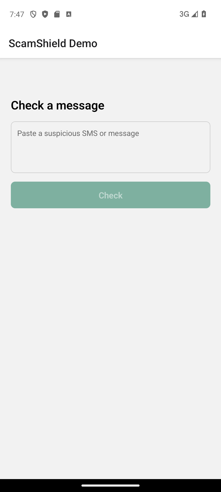
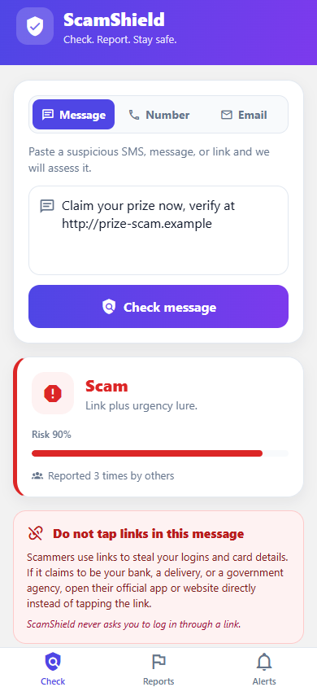
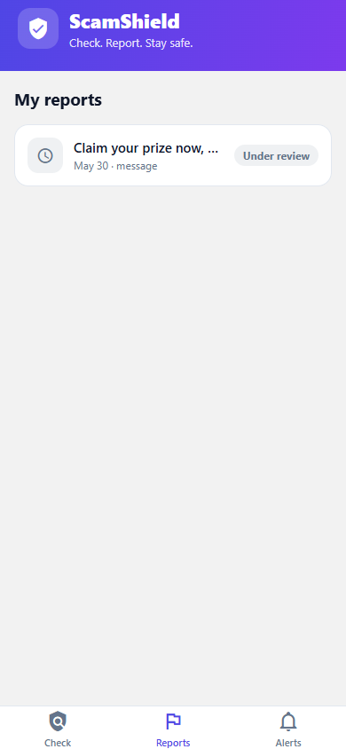
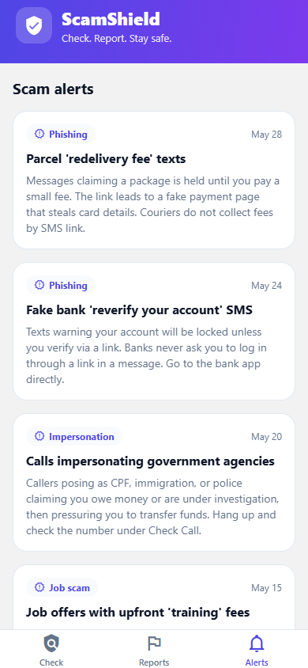
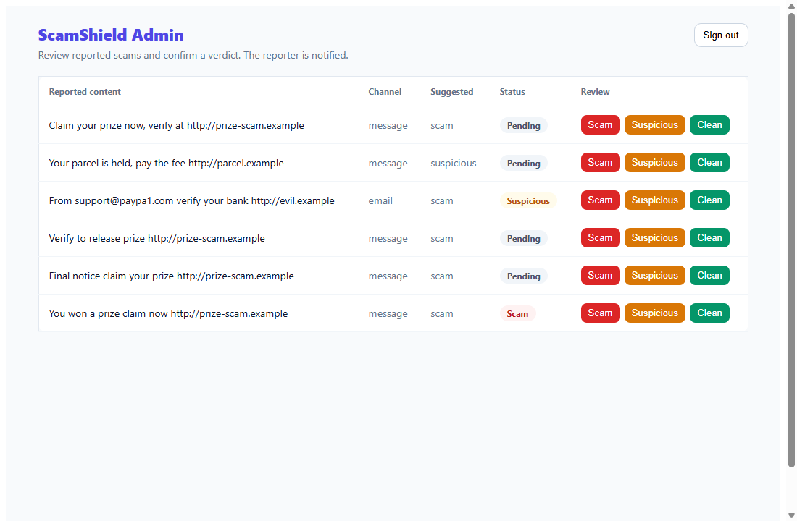

# ScamShield (unofficial)

An anti-scam app mirroring Singapore's ScamShield: check a suspicious **message, phone number, or email**, get a verdict **with the signals behind it**, report scams and track their status while a **reviewer verifies them** in an admin dashboard (with **search, CSV export, and a scam-number blocklist**), see scam **stats** and "reported N times" clustering, and read scam-awareness **alerts**. A React Native (Expo) tabbed app + a React admin web app, backed by a NestJS API on AWS serverless (durable **Postgres** state), plus the native **call-screening / SMS-filtering** layer that JavaScript cannot do.

This is a personal portfolio build that mirrors the **stack and shape** of Singapore's ScamShield. It is **not affiliated with, endorsed by, or connected to** the official ScamShield, Open Government Products, GovTech, or the Singapore Police Force. "ScamShield" is used here only to describe what this replica is modeled on.

## Demo

The four surfaces, against the **live AWS API** (verdicts, the verified-caller label, report status, and alerts all come from the deployed backend):

| Check + stats | Scam verdict (cluster + warning) | My reports | Scam alerts |
|---|---|---|---|
|  |  |  |  |

The Check screen has a Message / Number / **Email** toggle and a scam-stats strip; a flagged verdict shows the "reported N times" cluster count and a do-not-tap link warning; a report stays **Under review** until an admin verifies it.

**Admin verification dashboard** (the reviewer marks each report; the verdict notifies the reporter):



- **Live API:** https://14cet1wgg0.execute-api.ap-southeast-1.amazonaws.com/health
- **App browser preview** (the same React Native components via react-native-web, against the live API): https://elleskay.github.io/scamshield/
- **Admin verification dashboard** (React): https://elleskay.github.io/scamshield/admin/ (needs the admin token)
- The **native Android app** is exercised end to end by Maestro on an emulator in CI and built as a signed release APK; the native call-screening service is wired and compiled in (see `docs/MOBILE.md`).

## Why it exists

Built to demonstrate the stack and engineering practices of the real ScamShield (TypeScript + React, NestJS, PostgreSQL, AWS, IaC, CI/CD, SSDLC, SQS, OpenSearch, ML/LLM classification, push notifications). The point is not feature breadth, it is rigor: every requirement is specified, tested at the right layer, and proven by a real run, including on-device end-to-end and a real cloud deploy.

## Stack

- **App:** Expo (React Native) + Expo Router, TypeScript strict
- **API:** NestJS (TypeScript), class-validator at the boundary, serverless-express on AWS Lambda + API Gateway
- **Async:** AWS SQS report-intake queue + idempotent worker Lambda
- **Classifier:** offline heuristic on-device + a server classifier with an LLM hook (deterministic fallback). Recognizes trusted registered senders (CPF, IRAS, ...), legitimate OTP messages, and scam numbers embedded in text, and returns the signals behind each verdict
- **Push:** Expo push (APNs/FCM) when a report is confirmed a scam
- **Data:** Postgres (node-postgres; Neon's pooled endpoint) when `DATABASE_URL` is set, with an in-memory fallback for CI/local; OpenSearch-ready for clustering
- **Infra:** AWS CDK (Lambda + API Gateway HTTP API + SQS), GitHub Actions
- Built on a custom mobile platform template: https://github.com/elleskay/mobile-platform

## What is proven (not just written)

Every requirement in `specs/scamshield.yml` is verified by a real run at its declared layer, in CI:

| Layer | Requirements | Proven by |
|---|---|---|
| Unit (data) | message/number/email classifier verdicts, trusted-sender + OTP + scam-number-in-message handling, verdict signals, native block decision, blocklist match | jest-expo, in CI |
| Component (ui) | check button state, verified-caller + verified-sender badges, "why this result" signals, alerts list, stats strip, link warning | jest-expo + React Native Testing Library, in CI |
| Integration (API) | check (message/number/trusted-sender/number-in-message), blocklist + admin upload, reports listing, admin search + CSV export, alerts, stats + clustering, admin list/verify/auth, key-gated LLM + fallback, validation 400s, idempotent SQS consumer, push on admin review, durable Postgres store | vitest + supertest, in CI |
| E2E (journey) | check message/number/email, report → appears under Reports, **admin verifies a report in the dashboard** | **Maestro (Android emulator)** + **Playwright (admin web)** against a live API, in CI |
| Manual (security) | no secrets in the release bundle | signed verification artifact (real bundle scan) |

The API runs live on AWS (`cdk deploy`, reproducible via `infra/cdk`); the browser previews and the e2e suites hit it.

**Human-in-the-loop:** a report is `pending` until an admin reviews it in the dashboard; the classifier's call is recorded as a suggestion, and the push to the reporter fires on the admin's verdict, mirroring the real "police verify, then notify" flow.

**Persistence:** the report store, idempotent processing, clustering, stats, and the admin-uploaded number blocklist sit behind a `ReportsStore` boundary with two backends — **Postgres** (`node-postgres`, durable and correct across the split Lambda + SQS topology) and an **in-memory** fallback (CI/local/offline). The **live API runs on Postgres** (Neon's pooled endpoint, set via `DATABASE_URL`), with the app's tables isolated in a dedicated `scamshield` schema; the in-memory backend covers CI/local. The Postgres path is proven in CI against a Postgres service container (`SCAM-DB-001`).

The native Android `CallScreeningService` is wired by an Expo config plugin (verified: `expo prebuild` injects it into the manifest and it compiles into the release APK); its block decision is unit-tested, and the on-device call-rejection procedure is in `docs/MOBILE.md`. The iOS Call Directory + Message Filter extensions ship as code but need Apple signing + a device to verify, so they are documented there, not claimed as proven.

## How it is tested (spec-driven gate)

The build is driven by a YAML spec with one ID per requirement, and a coverage gate that refuses to pass unless every requirement has a passing test at its declared `verify` level (`unit | component | integration | contract | e2e | native | manual`). Native/manual requirements (things a JS test cannot prove, like OS-level behavior or a no-secrets bundle scan) are satisfied by a signed, freshness-checked verification artifact rather than a green checkmark nobody earned. See `docs/TESTING.md`.

## Run it

```bash
npm install
npm run test:spec        # jest-expo + vitest, then the coverage gate
npm run -w @app/scamshield start          # Expo dev server
npm run -w @service/scamshield-api start:dev   # API on :3000
```

Deploy the API (needs an AWS account, see `docs/DEPLOY.md` and `docs/SETUP.md`):

```bash
cd infra/cdk/_template && npm install && npx cdk deploy
```

## Structure

```
apps/app/
  app/(tabs)/        Check / Reports / Alerts screens (Expo Router tabs)
  components/        Shared UI (header, verdict card, alert list, stats strip, warning)
  lib/               API client, classifiers, device token, blocklist sync
  native/            CallScreeningService (Kotlin), Call Directory + Message Filter (Swift)
  plugins/           Expo config plugins that wire the native code at prebuild
  .maestro/          e2e flows
apps/admin/          React (Vite) admin verification dashboard + Playwright e2e
services/api/        NestJS API (reports, numbers, alerts, stats, admin, SQS consumer, classifier, push)
infra/cdk/           CDK: NestjsApi construct (Lambda + API Gateway + SQS)
packages/spec-test/  Spec-driven test runner + coverage gate
specs/scamshield.yml The requirement spec
```

## Scope and roadmap

**Phase 1 (the spine):** check-and-report a message, API + SQS intake, push on scam, input validation, no secrets in the bundle.

**Phase 2 (built):** the broader ScamShield surface, in `Check / Reports / Alerts` tabs.
- **Check Call**: look up a phone number (known scam / verified government caller / unknown), backed by `/numbers/check`.
- **My Reports**: a device sees its own reports and their verification status (`queued -> scam/suspicious/clean`).
- **Scam Alerts**: an awareness feed of emerging-scam advisories.
- **Native call/SMS interception**: Android `CallScreeningService` (Kotlin) + iOS Call Directory and Message Filter extensions (Swift), wired by Expo config plugins, fed by a blocklist the app syncs from `/numbers/blocklist`. Android is verified end to end on an emulator; iOS verification needs Apple signing (see `docs/MOBILE.md`).

**Phase 3 (built):** closing the gaps to the real product.
- **Admin verification dashboard** (React/Vite, `apps/admin`): a reviewer lists reports and marks each scam/suspicious/clean; the verdict triggers the push. The report stays `pending` until reviewed (the classifier's call is shown as a suggestion).
- **Email** check-and-report channel, with a spoofed-sender heuristic.
- **Stats + clustering**: `/stats` counters and a "reported N times" cluster count.
- **In-app link warning** for flagged messages with a link.
- **Key-gated LLM classifier**: real endpoint integration used when configured, deterministic heuristic otherwise; no secret committed.

**Phase 4 (built):** durable **Postgres** persistence behind the `ReportsStore` boundary (Neon in production, in-memory for CI/local), making stats, clustering, and status correct across the split Lambda + SQS topology.

**Phase 5 (built):** more of the real product's surface.
- **Trusted-sender whitelist**: a message from a registered Sender ID (CPF, IRAS, MOM, MAS, ...) is shown as a verified sender.
- **Scam number within a message**: a known scam number in the body escalates the verdict and is surfaced.
- **Admin search + CSV export**: filter reports by content/status/channel/device and export a date-ranged CSV.

**Phase 6 (built):** quality and operations.
- **OTP-aware classification**: a genuine one-time-passcode message (no link) is treated as safe instead of flagged.
- **Per-signal "why"**: each verdict carries the signals that justify it, surfaced in the verdict card.
- **Admin blocklist upload**: a reviewer adds scam numbers to the durable blocklist that the app syncs for native call screening.

Not built (out of scope, by design): the WhatsApp/Telegram ScamShield Bot, iMessage/RCS, HTX and law-enforcement data sharing, bank/telco data-sharing and Singpass Anti-Fraud integrations, the Google LLM-collaboration program, and real account auth (the admin uses a shared demo token; app checks are anonymous with an opaque device token). These need real partner/government systems, so they are deliberately not faked.

## Disclaimer

Unofficial, educational/portfolio project. Not the official ScamShield. Do not use it to report real scams; use the official ScamShield channels.
