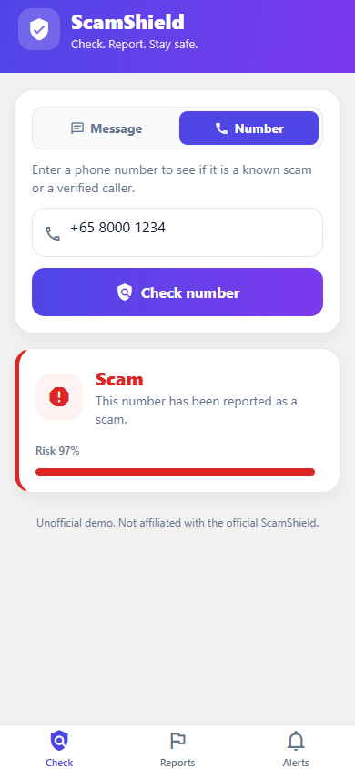

# ScamShield (unofficial)

An anti-scam app mirroring Singapore's ScamShield: check a suspicious **message** or **phone number**, get a verdict, report confirmed scams and track their status, and read scam-awareness alerts. A React Native (Expo) tabbed app backed by a NestJS API on AWS serverless, plus the native **call-screening / SMS-filtering** layer that JavaScript cannot do.

This is a personal portfolio build that mirrors the **stack and shape** of Singapore's ScamShield. It is **not affiliated with, endorsed by, or connected to** the official ScamShield, Open Government Products, GovTech, or the Singapore Police Force. "ScamShield" is used here only to describe what this replica is modeled on.

## Demo

The four surfaces, against the **live AWS API** (verdicts, the verified-caller label, report status, and alerts all come from the deployed backend):

| Check a message | Check a number | My reports + status | Scam alerts |
|---|---|---|---|
|  |  |  |  |

- **Live API:** https://14cet1wgg0.execute-api.ap-southeast-1.amazonaws.com/health
- **Browser preview** (the same React Native components via react-native-web, against the live API): https://elleskay.github.io/scamshield/
- The **native Android app** is exercised end to end by Maestro on an emulator in CI (4/4 journeys) and built as a signed release APK; the native call-screening service is wired and compiled in (see `docs/MOBILE.md`).

## Why it exists

Built to demonstrate the stack and engineering practices of the real ScamShield (TypeScript + React, NestJS, PostgreSQL, AWS, IaC, CI/CD, SSDLC, SQS, OpenSearch, ML/LLM classification, push notifications). The point is not feature breadth, it is rigor: every requirement is specified, tested at the right layer, and proven by a real run, including on-device end-to-end and a real cloud deploy.

## Stack

- **App:** Expo (React Native) + Expo Router, TypeScript strict
- **API:** NestJS (TypeScript), class-validator at the boundary, serverless-express on AWS Lambda + API Gateway
- **Async:** AWS SQS report-intake queue + idempotent worker Lambda
- **Classifier:** offline heuristic on-device + a server classifier with an LLM hook (deterministic fallback)
- **Push:** Expo push (APNs/FCM) when a report is confirmed a scam
- **Data:** PostgreSQL-ready (Neon), OpenSearch-ready for clustering similar reports
- **Infra:** AWS CDK (Lambda + API Gateway HTTP API + SQS), GitHub Actions
- Built on a custom mobile platform template: https://github.com/elleskay/mobile-platform

## What is proven (not just written)

Every requirement in `specs/scamshield.yml` is verified by a real run at its declared layer, in CI:

| Layer | Requirements | Proven by |
|---|---|---|
| Unit (data) | message + number classifier verdicts, native block decision | jest-expo, in CI |
| Component (ui) | check button enable/disable, verified-caller badge, alerts list | jest-expo + React Native Testing Library, in CI |
| Integration (API) | `/reports/check`, `/numbers/check` + blocklist, `/reports` listing by device, `/alerts`, validation 400s, idempotent SQS consumer, push on scam | vitest + supertest, in CI |
| E2E (journey) | check-a-message, check-a-number, report-a-scam, report-appears-under-Reports | **Maestro on an Android emulator against the live API**, in CI (4/4 flows) |
| Manual (security) | no secrets in the release bundle | signed verification artifact (real bundle scan) |

The API runs live on AWS (`cdk deploy`, reproducible via `infra/cdk`); the browser preview and Maestro e2e both hit it.

The native Android `CallScreeningService` is wired by an Expo config plugin (verified: `expo prebuild` injects it into the manifest and it compiles into the release APK); its block decision is unit-tested, and the on-device call-rejection procedure is in `docs/MOBILE.md`. The iOS Call Directory + Message Filter extensions ship as code but need Apple signing + a device to verify, so they are documented there, not claimed as proven.

## How it is tested (spec-driven gate)

The build is driven by a YAML spec with one ID per requirement, and a coverage gate that refuses to pass unless every requirement has a passing test at its declared `verify` level (`unit | component | integration | contract | e2e | native | manual`). Native/manual requirements (things a JS test cannot prove, like OS-level behavior or a no-secrets bundle scan) are satisfied by a signed, freshness-checked verification artifact rather than a green checkmark nobody earned. See `docs/TESTING.md`.

## Run it

```bash
npm install
npm run test:spec        # jest-expo + vitest, then the coverage gate
npm run -w @app/scamshield start          # Expo dev server
npm run -w @service/scamshield-api start:dev   # API on :3000
```

Deploy the API (needs an AWS account, see `docs/DEPLOY.md` and `docs/SETUP.md`):

```bash
cd infra/cdk/_template && npm install && npx cdk deploy
```

## Structure

```
apps/app/
  app/(tabs)/        Check / Reports / Alerts screens (Expo Router tabs)
  components/        Shared UI (header, verdict card, alert list)
  lib/               API client, classifiers, device token, blocklist sync
  native/            CallScreeningService (Kotlin), Call Directory + Message Filter (Swift)
  plugins/           Expo config plugins that wire the native code at prebuild
  .maestro/          e2e flows
services/api/        NestJS API (reports, numbers, alerts, SQS consumer, classifier, push)
infra/cdk/           CDK: NestjsApi construct (Lambda + API Gateway + SQS)
packages/spec-test/  Spec-driven test runner + coverage gate
specs/scamshield.yml The requirement spec
```

## Scope and roadmap

**Phase 1 (the spine):** check-and-report a message, API + SQS intake, push on scam, input validation, no secrets in the bundle.

**Phase 2 (built):** the broader ScamShield surface, in `Check / Reports / Alerts` tabs.
- **Check Call**: look up a phone number (known scam / verified government caller / unknown), backed by `/numbers/check`.
- **My Reports**: a device sees its own reports and their verification status (`queued -> scam/suspicious/clean`).
- **Scam Alerts**: an awareness feed of emerging-scam advisories.
- **Native call/SMS interception**: Android `CallScreeningService` (Kotlin) + iOS Call Directory and Message Filter extensions (Swift), wired by Expo config plugins, fed by a blocklist the app syncs from `/numbers/blocklist`. Android is verified end to end on an emulator; iOS verification needs Apple signing (see `docs/MOBILE.md`).

Not built (out of scope for this portfolio): the police admin dashboard, the WhatsApp ScamShield Bot, and account auth (checks are anonymous; reports carry an opaque device token).

## Disclaimer

Unofficial, educational/portfolio project. Not the official ScamShield. Do not use it to report real scams; use the official ScamShield channels.
